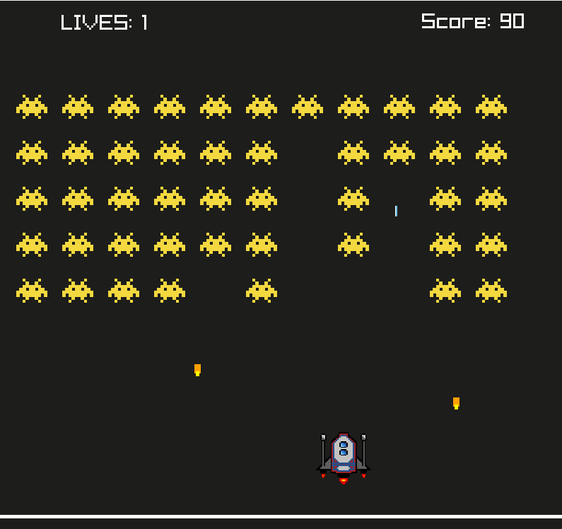
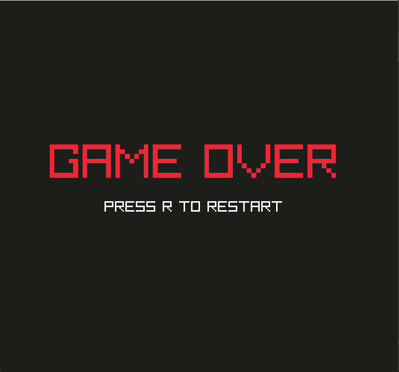

# 🎮 Space Invaders — OOP C++ Game


A Space Invaders arcade game built from scratch in **C++** using the **Raylib** graphics library. Each game element is implemented as a separate class, structured around a shared abstract base class.

Initially developed as a single-file project and later refactored into a modular object-oriented design using header files. This refactor significantly improved my understanding of OOP design principles and code architecture.

---

## 🚀 Features

- 🚀 Player-controlled spaceship with smooth movement  
- 👾 Alien grid that moves side to side and gradually descends  
- 🔫 Player shooting mechanics  
- 💥 Enemies can fire back, requiring dodging and timing  
- 🎯 Collision detection for player and enemy projectiles  
- 🏆 Score system (+10 per alien destroyed)  
- ❤️ 3 lives before game over  
- 🎉 Win condition when all aliens are eliminated  
- 💀 Game over screen with restart option  
- 🔄 Restart anytime using `R`  
- ⚡ Smooth 60 FPS gameplay loop  

---

## 📸 Screenshots

### Gameplay


### Game Over


## 🧠 OOP Design

| Concept | Implementation |
|:--------|:--------------|
| **Abstraction** | `Entity` is an abstract base class with pure virtual functions |
| **Inheritance** | `Spaceship`, `Alien`, `Laser`, `AlienBullets` inherit from `Entity` |
| **Polymorphism** | `Draw()` and `Update()` are overridden in derived classes |
| **Encapsulation** | Core attributes like position and speed are protected within classes |
| **Modular Design** | Each class is implemented in separate header files |

### Class Hierarchy

```text
Entity (abstract base class)
│
├── Spaceship
├── Alien
├── Laser
└── AlienBullets
```

---

## 📁 Project Structure

```text
Space-Invaders-OOP/
│
├── src/
│   ├── Space_Invaders2.cpp
│   ├── Space_invaders.cpp
│   ├── Entity.h
│   ├── Spaceship.h
│   ├── Alien.h
│   ├── Laser.h
│   ├── AlienBullets.h
│   ├── Game.h
│   ├── Rocket.png
│   └── alien_2.png
│
└── README.md
```

---

## 🎮 Controls

| Key | Action |
|:----|:-------|
| `A` / `←` | Move left |
| `D` / `→` | Move right |
| `Spacebar` | Shoot |
| `R` | Restart game |
| `Esc` | Quit |

---

## ⚙️ How to Run

### Requirements
- C++17 compatible compiler (G++)
- Raylib 5.5
- Windows OS

### Compile & Run

**Using Terminal:**
```bash
g++ -std=c++17 Space_Invaders2.cpp -o Space_Invaders2 -I. -lraylib -lopengl32 -lgdi32 -lwinmm
./Space_Invaders2
```

**Using VS Code:**
1. Open project folder in VS Code
2. Press `Ctrl + Shift + B` to build
3. Press `F5` to run/debug

---

## 👨‍💻 Developer

**Kartar Singh** CS Student @ IBA Karachi  
GitHub: [https://github.com/kartar-singh-cs](https://github.com/kartar-singh-cs)

---

## 📌 Why I Built This

This project was built to go beyond writing functional code and focus on proper software design. It helped me understand object-oriented programming principles such as inheritance, abstraction, and polymorphism.
